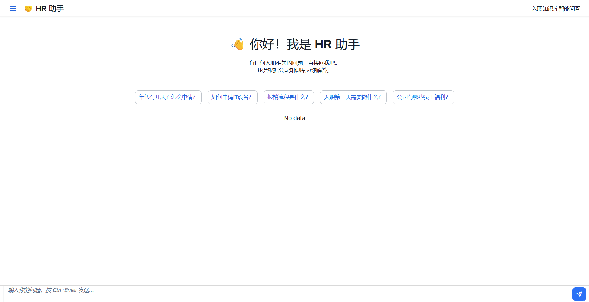
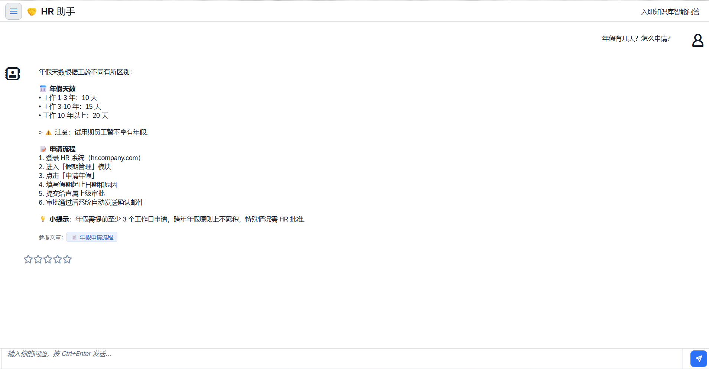
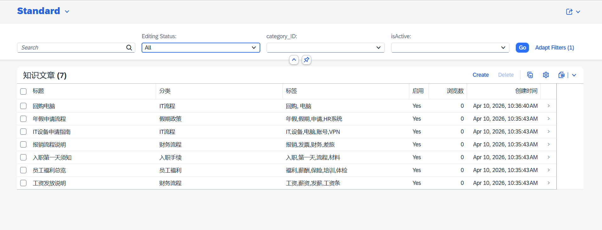

# 员工入职知识库问答助手

SAP CAP (Node.js) + Claude AI 驱动的企业内部 HR 知识库问答系统。

## 界面预览

**员工问答页 — 欢迎界面**



**员工问答页 — 问答效果（含引用文章与星级评分）**



**知识库管理页（Fiori Elements List Report）**



## 快速启动

### 1. 安装依赖

```bash
cd onboarding-kb-assistant
npm install
```

### 2. 配置环境变量

```bash
cp .env.example .env
# 编辑 .env，填入以下内容：
# ANTHROPIC_API_KEY=your-key-here
# ANTHROPIC_BASE_URL=your-proxy-url  （可选，如有公司代理）
```

### 3. 初始化数据库

首次运行前需要部署数据库 schema（含 draft 表）：

```bash
npx cds deploy --to sqlite:db.sqlite
```

### 4. 启动服务

```bash
npx cds watch
```

服务启动后访问：

| 页面 | URL |
|------|-----|
| 员工问答页（UI5版） | http://localhost:4004/chat-ui5/index.html |
| 员工问答页（原版） | http://localhost:4004/chat/index.html |
| 知识库管理（Fiori Elements） | http://localhost:4004/kbmanager/index.html |
| OData Admin API | http://localhost:4004/admin |
| OData Knowledge API | http://localhost:4004/api |

### 5. 快速验证 Claude API 连通性

```bash
node test/quick-test.js
```

## API 使用示例

### 提问

```bash
curl -X POST http://localhost:4004/api/askQuestion \
  -H "Content-Type: application/json" \
  -d '{"question": "年假有几天？怎么申请？"}'
```

### 评分

```bash
curl -X POST http://localhost:4004/api/rateAnswer \
  -H "Content-Type: application/json" \
  -d '{"messageId": "<uuid>", "rating": 5}'
```

### 查看知识库文章

```bash
curl http://localhost:4004/api/KnowledgeArticles
```

## 项目结构

```
onboarding-kb-assistant/
├── db/
│   ├── schema.cds                          # 数据模型
│   └── data/
│       ├── onboarding.kb-Categories.csv    # 分类种子数据（5条，UUID 主键）
│       └── onboarding.kb-KnowledgeArticles.csv  # 文章种子数据（6篇，UUID 主键）
├── srv/
│   ├── knowledge-service.cds              # Service 定义（AdminService + KnowledgeService）
│   ├── knowledge-service.js               # Service Handler（全部使用 raw SQL）
│   └── lib/
│       └── claude-client.js               # Claude API 封装（支持 baseURL 代理）
├── app/
│   ├── services.cds                       # CAP 扫描入口
│   ├── chat/
│   │   └── index.html                     # 员工问答聊天页（纯 HTML/CSS/JS）
│   ├── chat-ui5/                          # 员工问答聊天页（SAPUI5 版）
│   │   ├── ui5.yaml
│   │   ├── package.json
│   │   └── webapp/
│   │       ├── manifest.json
│   │       ├── Component.js
│   │       ├── index.html
│   │       ├── view/Chat.view.xml
│   │       ├── controller/Chat.controller.js
│   │       └── i18n/i18n.properties
│   └── kb-manager/                        # 知识库管理（Fiori Elements）
│       ├── annotations.cds                # UI 注解（含 ValueHelp、CRUD 能力）
│       ├── ui5.yaml
│       ├── package.json
│       └── webapp/
│           ├── manifest.json
│           ├── Component.js
│           ├── index.html
│           └── i18n/i18n.properties
├── test/
│   ├── quick-test.js                      # Claude API 连通性快速测试
│   └── claude-client.test.js              # 单元测试
├── db.sqlite                              # SQLite 持久化数据库（gitignored）
├── .env                                   # 本地环境变量（gitignored）
├── .env.example
├── package.json
└── README.md
```

## 数据持久化说明

数据保存在本地 `db.sqlite` 文件中，重启服务不会丢失。

如需重置为初始种子数据，删除 `db.sqlite` 后重新运行 `npx cds deploy --to sqlite:db.sqlite`。

## 运行测试

```bash
npm test
```
